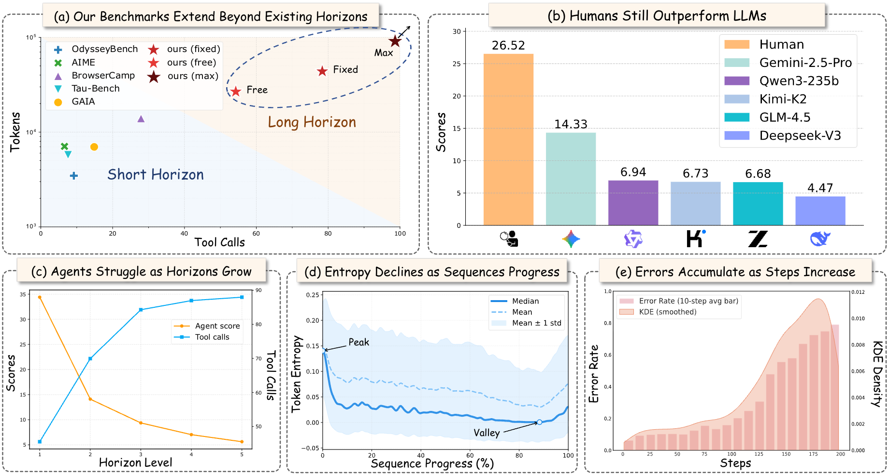
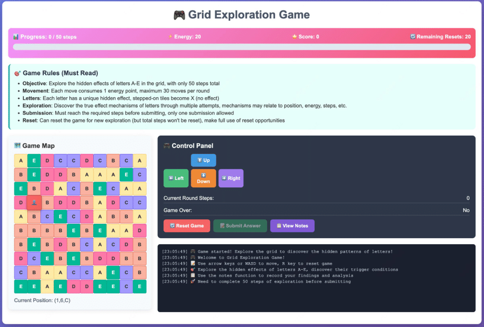
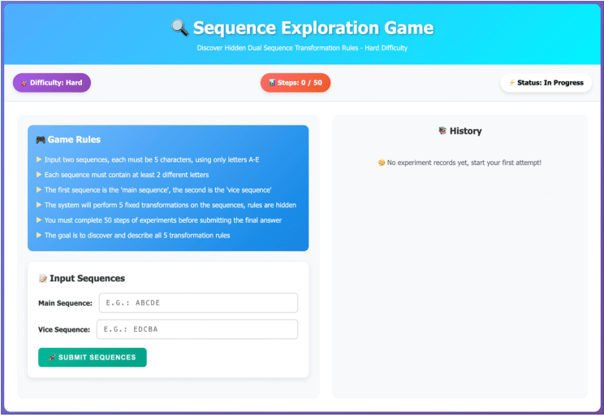
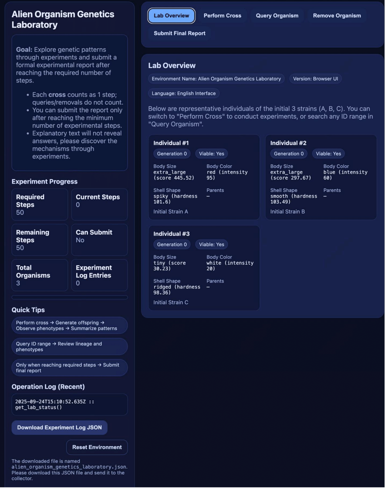

---

# UltraHorizon🔭: Benchmarking Agent Capabilities in Ultra Long-Horizon Scenarios

---

## Introduction 📖



Many real-world tasks are inherently long-horizon and partially observable. A robust agent should be capable of effectively handling such challenges. **UltraHorizon** is designed to investigate and evaluate agent performance in **ultra long-horizon scenarios**. In our study, the maximum number of tool calls reaches over 400, with trajectory lengths extending up to 200k steps. Unlike NIAH (Needle-in-a-Haystack) tasks, which primarily involve retrieving information over long contexts, our benchmark requires agents to **sustain operation within an environment**, encompassing long-horizon reasoning, planning, memory management, and tool usage. Our key findings are as follows:

1. Some LLMs exhibit a tendency to terminate prematurely rather than sustaining the deliberation and exploration required by long-horizon tasks.
2. LLMs significantly underperform humans on UltraHorizon, despite often surpassing human baselines on math-reasoning benchmarks.
3. Agent performance declines sharply as the horizon length increases, indicating that **sustaining reasoning over long horizons** is a major bottleneck for current LLM agents.
4. Simply increasing the number of interaction steps does not consistently improve long-horizon task performance.
5. Agents tend to become trapped in early assumptions and narrow strategies. Entropy analysis confirms the presence of an **in-context locking effect**, whereby agents’ exploration diversity diminishes over time.

---

## Running LLM Agents in Our Environment 🧩

1. Install the packages required by **OpenManus**.
2. Configure your agent by setting the LLM parameters in `./OpenManus/config/config.toml`.
3. Configure the judge LLM in `./judge_config.yaml` (in our study, we used **DeepSeek-R1-0528-BF16**).
4. Run experiments with a command such as:

```bash
APP_CONFIG_PATH=OpenManus/config/config.toml WINDOW_SIZE=200 python parallel_run.py --env seq --steps 50 --index part1 --n_experiments 4 --max_concurrency 4 --exp_folder exps_seq
```

5. Results can be found in the `exps_seq` folder.

**Notes:**

1. The `steps` parameter in the launch command does not represent the actual number of tool calls. The true number of tool calls is typically **1.5 to 6 times** the number of steps.
2. Due to the high number of interactions and long trajectories, running experiments without a **prefix cache** can incur substantial API costs. For instance, with `steps=50`, the cumulative input tokens for non-thinking models range from approximately **1M to 10M**, while output tokens range from **10k to 50k** per interaction.
3. Single-run variance is high; we recommend repeating each experimental setting **32 times** (i.e., `n_experiments=32`) to reduce variance and obtain more stable results.

---

## GUI Version 🎮
The GUI version of three environments are available under `gui_version`, allowing users to intuitively experience the design and long-horizon of our environment (open the html file with browser).

#### Mystery Grid

#### Sequence Explore

#### Alien Genetics Laboratory

